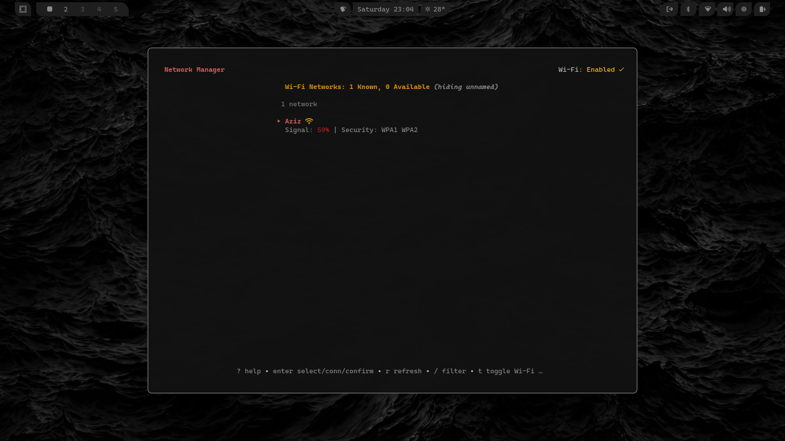

# Go Network Manager TUI (nmtui-go)

[](https://github.com/your-username/nmtui/actions/workflows/release.yml)
[](https://github.com/your-username/nmtui/releases/latest)
<!-- Add other badges if you like: license, issues, etc. -->

A Terminal User Interface (TUI) for managing NetworkManager Wi-Fi connections on Linux systems, built with Go and the [Bubble Tea](https://github.com/charmbracelet/bubbletea) framework. This tool provides a keyboard-driven, user-friendly way to scan, connect to, and manage Wi-Fi networks directly from your terminal.

<!-- Optional: Add a screenshot or GIF of the TUI in action -->
<!--  -->

## Overview

`nmtui-go` (this project's name, can be changed) aims to offer a modern and convenient alternative or supplement to `nmcli` for common Wi-Fi tasks, especially on headless systems or for users who prefer terminal-based tools. It leverages the power of `nmcli` in the background for network operations while providing an interactive and visually organized frontend.

## Why Use `nmtui-go`?

*   **User-Friendly TUI:** Offers a more intuitive and guided experience compared to typing raw `nmcli` commands.
*   **Keyboard Driven:** Optimized for keyboard-only operation, perfect for servers or quick interactions without a mouse.
*   **At-a-Glance Information:** Clearly displays available networks, signal strength, security, and connection status.
*   **Simplified Workflow:** Streamlines common tasks like scanning, connecting to open/secured networks, and viewing connection details.
*   **Lightweight & Performant:** Built with Go, it's a single, relatively small binary with minimal dependencies (beyond NetworkManager itself).
*   **Responsive Design:** Adapts to different terminal sizes and themes (supports adaptive colors for light/dark modes).
*   **Informative Feedback:** Provides clear status messages for connection attempts, errors, and other operations.

## Features

*   **Scan for Wi-Fi Networks:** Actively rescan or list currently visible access points.
*   **Connect to Networks:**
    *   Connect to open (unsecured) networks.
    *   Connect to WPA/WPA2 PSK (password-protected) networks by prompting for a password.
    *   Automatically uses existing NetworkManager profiles if available.
*   **Network List Display:**
    *   Shows SSID, signal strength (with color indicators), security type.
    *   Indicates currently active (✔) and known (★) networks.
    *   Option to show/hide unnamed (hidden SSID) networks.
    *   Sorts networks by active, known, and then signal strength.
*   **Active Connection Info:** Display detailed information about the current active Wi-Fi connection (IP address, MAC, gateway, DNS, etc.).
*   **Manage Wi-Fi Radio:** Toggle the Wi-Fi radio on/off.
*   **Disconnect:** Disconnect from the currently active Wi-Fi network.
*   **Filtering:** Filter the network list by SSID.
*   **Responsive Layout:** UI elements adjust to terminal window size.
*   **Help View:** In-app help displays available keybindings, togglable between short and full views.

## Requirements

*   **Linux Operating System:** This tool relies heavily on `nmcli`.
*   **NetworkManager:** Must be installed and running on your system. `nmcli` is its command-line interface.
*   **`nmcli` command-line tool:** Must be installed and in the system's `PATH`.

## Installation

You can download the latest pre-compiled binary for your Linux distribution and architecture from the [GitHub Releases page](https://github.com/your-username/nmtui/releases/latest).

1.  Go to the [Releases page](https://github.com/your-username/nmtui/releases/latest).
2.  Download the appropriate `.tar.gz` archive for your system (e.g., `nmtui_vx.y.z_linux_amd64.tar.gz`).
3.  Extract the archive:
    ```bash
    tar -xvf nmtui_vx.y.z_linux_amd64.tar.gz
    ```
4.  This will extract the `nmtui` binary (and `README.md`, `LICENSE`).
5.  Move the `nmtui` binary to a directory in your system's `PATH`, for example:
    ```bash
    sudo mv nmtui /usr/local/bin/
    ```
6.  Ensure the binary is executable:
    ```bash
    sudo chmod +x /usr/local/bin/nmtui
    ```

Now you can run the application by typing `nmtui` in your terminal.

## Usage

Simply run the command:

```bash
nmtui
```

The application will start, scan for Wi-Fi networks, and display them in a list.

**Keybindings:**

The most common keybindings are displayed in the help bar at the bottom. Press `?` to toggle a more detailed help view.

*   **Arrow Keys (↑ / ↓):** Navigate the network list.
*   **Enter:**
    *   Select a network to connect.
    *   Confirm password input.
    *   Confirm disconnection.
    *   Dismiss connection result messages.
*   **Esc:**
    *   Go back from password input or other views.
    *   Cancel filtering.
    *   Dismiss connection result messages.
*   **`r`:** Refresh the list of Wi-Fi networks (rescan).
*   **`/`:** Start filtering the network list by SSID.
*   **`u`:** Toggle showing/hiding unnamed (hidden SSID) networks.
*   **`t`:** Toggle the Wi-Fi radio on or off.
*   **`d`:** Disconnect from the current active Wi-Fi network (will prompt for confirmation).
*   **`i`:** Show detailed information about the currently active Wi-Fi connection.
*   **`?`:** Toggle between short and full help display at the bottom.
*   **`q` / `Ctrl+C`:** Quit the application.

## How It's Made

`nmtui-go` is built using the following Go libraries and concepts:

*   **Go:** The programming language.
*   **[Bubble Tea](https://github.com/charmbracelet/bubbletea):** A powerful framework for building terminal user interfaces based on The Elm Architecture (Model-View-Update).
    *   **[Bubbles](https://github.com/charmbracelet/bubbles):** A collection of pre-built TUI components (list, textinput, spinner, viewport, help).
    *   **[Lipgloss](https://github.com/charmbracelet/lipgloss):** Used for styling text, backgrounds, borders, and layout in the TUI with a CSS-like approach.
*   **`os/exec`:** Used to execute `nmcli` commands in the background.
*   **`gonetworkmanager` (local package):** A custom Go wrapper around `nmcli` commands, responsible for:
    *   Parsing `nmcli` output.
    *   Formatting commands for connecting, scanning, getting status, etc.
    *   Handling basic error propagation from `nmcli`.

The application follows the Model-View-Update (MVU) pattern:
*   **Model:** Contains the entire state of the application (current view, list of networks, input fields, terminal dimensions, etc.).
*   **View:** Renders the current state as styled text to be displayed in the terminal.
*   **Update:** Handles incoming messages (user input, data loaded from `nmcli`, window resize events) and updates the model accordingly, potentially triggering new commands (like fetching data).

**Release Process:**
Releases are automated using [GoReleaser](https://goreleaser.com/) and [GitHub Actions](https://github.com/features/actions). When a new version tag (e.g., `vX.Y.Z`) is pushed to GitHub:
1.  The GitHub Actions workflow triggers.
2.  GoReleaser builds the Go binary for Linux (amd64, arm64).
3.  Version information (version, commit, date) is embedded into the binary.
4.  Archives (`.tar.gz`) are created containing the binary, README, and LICENSE.
5.  A new GitHub Release is created, and these archives are uploaded as assets.

## Troubleshooting & Gotchas

*   **"nmcli: command not found" or errors related to `nmcli`:**
    Ensure NetworkManager is installed and running, and that the `nmcli` command is available in your system's `PATH`. This tool is a frontend for `nmcli`.
*   **"Error: Connection activation failed: No suitable device found..." / Mismatching Interface Name:**
    This can happen if NetworkManager has an existing profile for an SSID that is tied to a specific, now incorrect, wireless interface name (e.g., `wlan0` when your interface is now `wlp3s0`).
    `nmtui-go` attempts to handle this by deleting and re-creating profiles when connecting to a known network that requires a password. If you encounter this persistently:
    1.  Try manually deleting the problematic connection profile using `nmcli con delete "Profile Name or UUID"`.
    2.  Then, try connecting again through `nmtui-go`.
*   **Wi-Fi Radio Won't Turn On/Off:**
    Some systems might have hardware switches or other software (like `rfkill`) that can block Wi-Fi. Ensure no such blocks are active.
*   **Incorrect Password:** The TUI will show a failure message. Double-check your password. The error from `nmcli` (visible in the debug log) often indicates "Secrets were required, but not provided" or similar for authentication failures.
*   **Hidden Networks:** Use the `u` key to toggle visibility of unnamed networks if you're trying to connect to one. You'll need to know its SSID.
*   **Debug Log:**
    If you encounter issues, you can run the application with debug logging enabled:
    ```bash
    DEBUG_TEA=1 nmtui
    ```
    This will create a `nmtui-debug.log` file in the directory where you run the command. This log contains detailed information about `nmcli` commands being executed and any errors, which can be very helpful for diagnosing problems. Please include relevant parts of this log if you are reporting an issue.
*   **Linux Only:** This tool is designed for Linux systems running NetworkManager. It will not work on macOS or Windows as it depends on `nmcli`.

## Contributing

Contributions are welcome! If you'd like to contribute, please:

1.  Fork the repository.
2.  Create a new branch for your feature or bug fix.
3.  Make your changes.
4.  Ensure your code is formatted (`gofmt` or `goimports`).
5.  Open a Pull Request with a clear description of your changes.

<!-- Optional:
## Future Ideas / Roadmap
*   Support for more Wi-Fi security types (e.g., WPA3, Enterprise).
*   Managing wired connections.
*   Editing existing connection profiles.
*   More detailed error parsing and user-friendly messages.
-->

## License

This project is licensed under the [Your Chosen License Name - e.g., MIT License](LICENSE).
